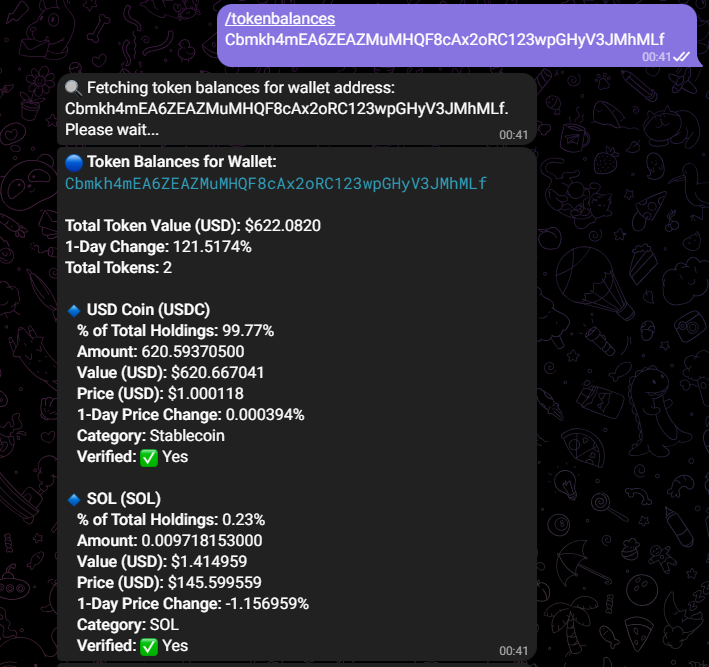
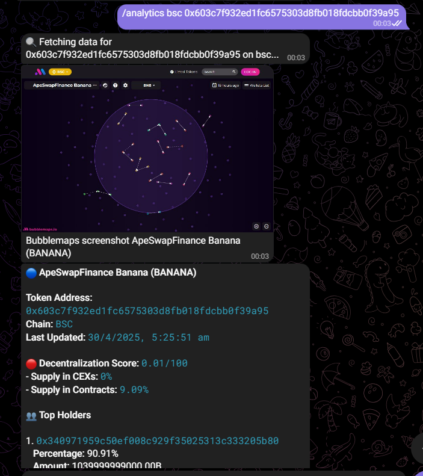
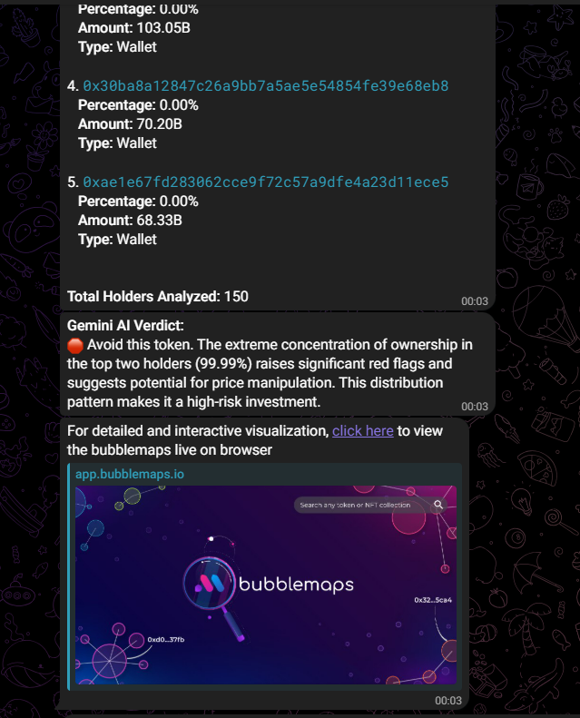
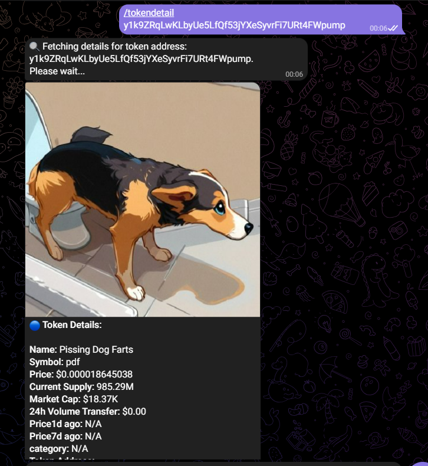
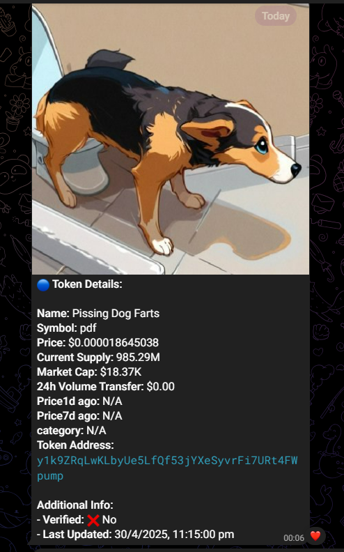
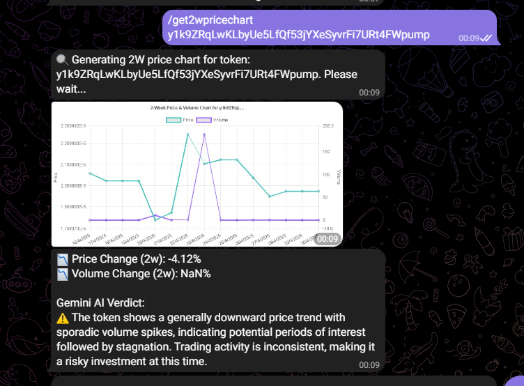

# 🤖 Bubblemaps Telegram Bot

A Telegram bot that brings **on-chain analytics** to your fingertips. Simply send a token's contract address along with the chain, and the bot delivers **visualizations** and **metrics** straight to your chat — powered by [Bubblemaps](https://www.bubblemaps.io).

## ✨ Features

- 📍 **Bubble Map Screenshot** — Instantly generates a map of token holder clusters.
- 📊 **Analytics Dashboard** — Market cap, price, volume, and more.
- 🧠 **Decentralization Score** — See how evenly a token is distributed.
- 💎 **Top Holders Info** — Know who holds what.
- 🌍 Supports multiple chains (via `[chain]` argument) \[Supported chains - eth, bsc, ftm, avax, cro, arbi, poly, base, sol, sonic]


## 🛠 Tech Stack

- **Language:** TypeScript
- **Server:** Express.js
- **Bot Framework:** [node-telegram-bot-api](https://github.com/yagop/node-telegram-bot-api)
- **Infra:** AWS EC2 (High performance deployment)
- **Other:** Puppeteer (for screenshots), Gemini API (for AI capabilities)


## 💬 Commands

```bash
/start
  Welcome message

/help
  Show this help message

/tokendetail <token address>
  Get token details

/analytics <chain> <token address>
  Get basic token info, decentralisation score, top holders info and map link

/get2wpricechart <token address>
  Get 2-week price and volume chart

/tokenbalances <wallet address>
  Get token balances for a wallet address

/walletpnl <wallet address>
  Get comprehensive PnL analysis for a wallet address

```


## 🚀 Getting Started

1. **Clone the Repo**
```bash
git clone https://github.com/your-username/bubblemaps-telegrambot.git
cd bubblemaps-telegrambot
```

2. **Install Dependencies**
```bash
npm install
```

3. **Set Up Environment Variables**
Create a `.env` file in the root directory and fill it with:
```ini
BOT_TOKEN=your-telegram-bot-token
GEMINI_API_KEY=your-gemini-api-key
```

4. **Build and Run the Bot**
```bash
npm run build
npm run start
```

## 📸 Screenshots

Below are example outputs for each supported command:

| Command         | Output(s)                                                                                                 |
|-----------------|----------------------------------------------------------------------------------------------------------|
| `/tokenbalances`|                                                                     |
| `/analytics`    |                                        |
| `/walletpnl`    |                                        |
| `/tokendetail`  |                                    |
| `/get2wpricechart`|  |


## 🤝 Contributing

We welcome PRs and contributions! Just follow these general rules:

- ✅ Follow conventional code style and naming.
- 🧪 Test your changes locally.
- 📄 Open an issue before big features.

<!-- ## 📄 License

MIT © Your Name -->

## 🌐 Live Bot

🟢 Bot is live! Find it on Telegram at @Bubblemaps_orbot
